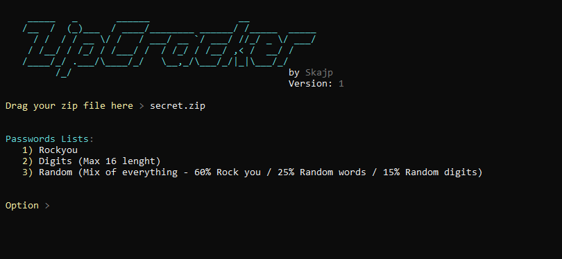

# ZipCracker
made by Skajp | discord: DeadSkajp#5906

This is simple zip cracker made in python

<br>

### It has 3 modes
- Rockyou - uses rockyou.txt (converted to utf-8 format)
- Digits - uses random digits
- Random - uses rockyou, digits and random generated words

<br><br>



<br><br>

# How to install it?

linux
```
git clone https://github.com/SkajpCZ/ZipCracker
cd ZipCracker
python3 ZipCracker.py
```